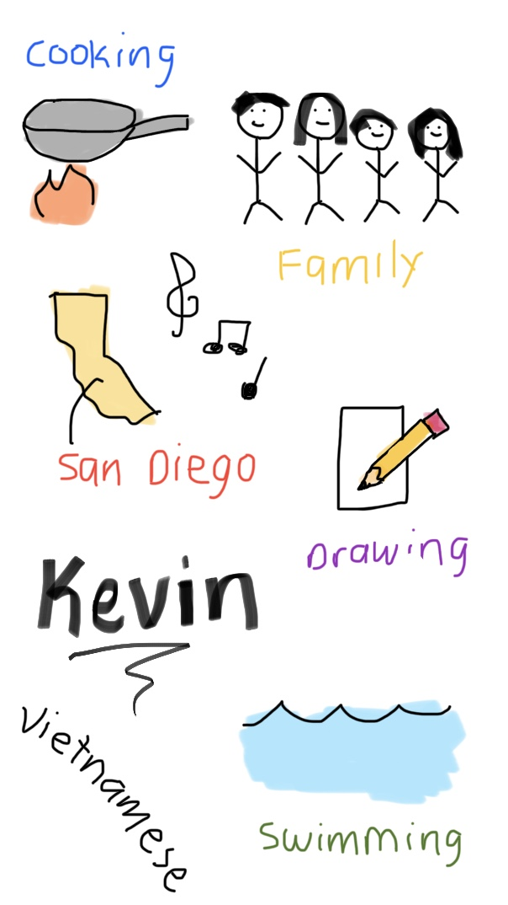

## Welcome to Kevin's Blog! 
Hello! My name is Kevin Tran, and I am a 11th grade student at Del Norte High School in San Diego, California. Some of my hobbies include drawing, listening to music, playing the piano, swimming, and record collecting. This website will tell you a little more about me!

<html>
<head>
</head>
<body>
    <h3>Weekly Progress</h3>
<table border="2px" style="width:50%;">
    <tr bgcolor="lightgray">
        <th style="width: 100px;">Week</th>
        <th width="width: 2000px;">Progress</th>
        <th width="width: 2000px;">Problems</th>
    </tr>
    <tr>
       <td>0</td>
       <td>This week, I installed the software required to start this course (VSCode and Homebrew). i tried to install the tools needed to run Github locally.
       <td>None </td>
    <tr>
        <td>1</td>
        <td>This week, I created a repository and installed the tools to run Github locally. I was able to create a blog website. I also worked on customizing the webpage; I learned how to change the theme of the webpage, insert images, and create tables to track my progress using HTML.
        <td>I had problems install some of the software tools (Python and Juypter Notebook) and with changing the theme. I searched up the issue on Google and looked through Stack Overflow to find solutions to resolve the issue.
    <tr>
        <td>2</td>
        <td> This week, I created a lab notebook and transferred the code from my old site to the my new site. I also added a snake game.
        <td> I learned that the 2 websites can't run on the same port, so I had to change the port. I had trouble adding an emoji apple, however, I retyped the code and it worked. 
    <tr>
        <td>3</td>